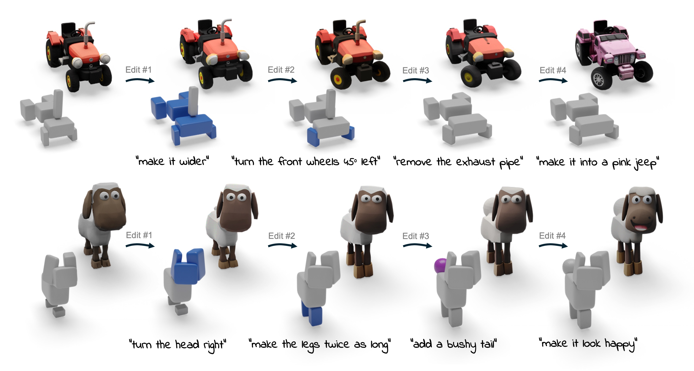

# Prox-E: Fine-Grained 3D Shape Editing via Primitive-Based Abstractions

**Etai Sella\*<sup>1</sup>, Hao Phung\*<sup>2</sup>, Nitay Amiel<sup>3</sup>, Or Litany<sup>3</sup>, Or Patashnik<sup>1</sup>, Hadar Averbuch-Elor<sup>2</sup>**

<sup>1</sup> Tel Aviv University  <sup>2</sup> Cornell University <sup>3</sup> Technion - Israel Institute of Technology  

This is the official PyTorch implementation of **Prox-E**.

[](https://arxiv.org/abs/2604.23774)


## 📄 Abstract

Text-based 2D image editing models have recently reached an impressive level of maturity, motivating a growing body of work that heavily depends on these models to drive 3D edits. While effective for appearance-based modifications, such 2D-centric 3D editing pipelines often struggle with fine-grained 3D editing, where localized structural changes must be applied while strictly preserving an object's overall identity. To address this limitation, we propose Prox-E, a training-free framework that enables fine-grained 3D control through an explicit, primitive-based geometric abstraction. Our framework first abstracts an input 3D shape into a compact set of geometric primitives. A pretrained vision-language model (VLM) then edits this abstraction to specify primitive-level changes. These structural edits are subsequently used to guide a 3D generative model, enabling fine-grained, localized modifications while preserving unchanged regions of the original shape. Through extensive experiments, we demonstrate that our method consistently balances identity preservation, shape quality, and instruction fidelity more effectively than various existing approaches, including 2D-based 3D editors and training-based methods.


<p align="center">

</p>

---

## 🚀 Getting Started

### Cloning the repository

Clone the repo and initialize submodules if your checkout stores `prox_e/submodules` as git submodules:

```bash
git clone <repo-url> Prox-E
cd Prox-E
git submodule update --init --recursive
```

### Environment Setup

Create the environment:

```bash
bash scripts/setup_environment.sh
conda activate prox-e
```

The setup script creates a Python 3.11 conda environment, installs PyTorch and the remaining Python dependencies, installs the two source-built rasterization packages, and downloads SuperDec checkpoints if they are missing. 

### Blender

The code expects Blender for utility renders. It first uses `BLENDER_PATH`, then `blender` on `PATH`, then the internal lab path. On a fresh machine, install Blender and make sure `blender` is on `PATH`; otherwise set:

```bash
export BLENDER_PATH=/path/to/blender
```

### VLM Setup

By default, Prox-E uses gemini as the VLM backbone in the proxy editing and prompt parsing stages. As such, it requires users have access to these models and set the google API key as such.

```bash
export GOOGLE_API_KEY=<your-key>
```

Our code also supports 

### Additional requirements

The SuperDec checkpoints are expected under `prox_e/submodules/superdec/checkpoints/normalized/`. If they are missing, run:

```bash
cd prox_e/submodules/superdec
bash scripts/download_checkpoints.sh
cd ../../..
```

## 🎮 Running the Demos

We include an demo edit example for each datset used in our work:

**ShapeNet**:

```bash
python inference.py \
  --input_mesh demo/shapenet/chair/model_normalized.obj \
  --category chair \
  --edit_instruction "make the chair 1.5 times wider"
```

**Edit3D-Bench**:

```bash
python inference.py \
  --input_mesh demo/edit3dbench/elephant/model.glb \
  --category elephant \
  --edit_instruction "make the elephant wear a red hat" \
  --edit3dbench
```

**Toys4K**:
```bash
python inference.py \
  --input_mesh demo/toys4k/sheep/model.glb \
  --category sheep \
  --edit_instruction "turn the sheep's head 30 degrees to the right"
```

Final results are saved in the `outputs/` folder.

## 🛋️ Running Prox-E on custom shapes

For a custom mesh, set `--input_mesh` to the mesh file, `--category` to the object class, and `--edit_instruction` to the requested edit:

```bash
python inference.py \
  --input_mesh /path/to/model.glb \
  --category lamp \
  --edit_instruction "make the lamp shade wider"
```

If the mesh orientation is wrong, render all supported input orientations:

```bash
python scripts/orientation_sweep.py --input_mesh /path/to/model.glb
```

Open the generated `orientation_sweep_overview.png`, pick the best index, then rerun inference with it:

```bash
python inference.py \
  --input_mesh /path/to/model.glb \
  --category lamp \
  --edit_instruction "make the lamp shade wider" \
  --orientation_index 12
```

If you change the orientation for a mesh you already processed, use a fresh `--output_folder` so cached abstractions are not reused.
